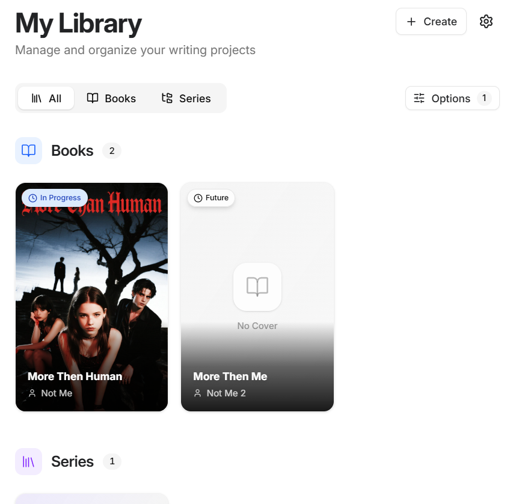
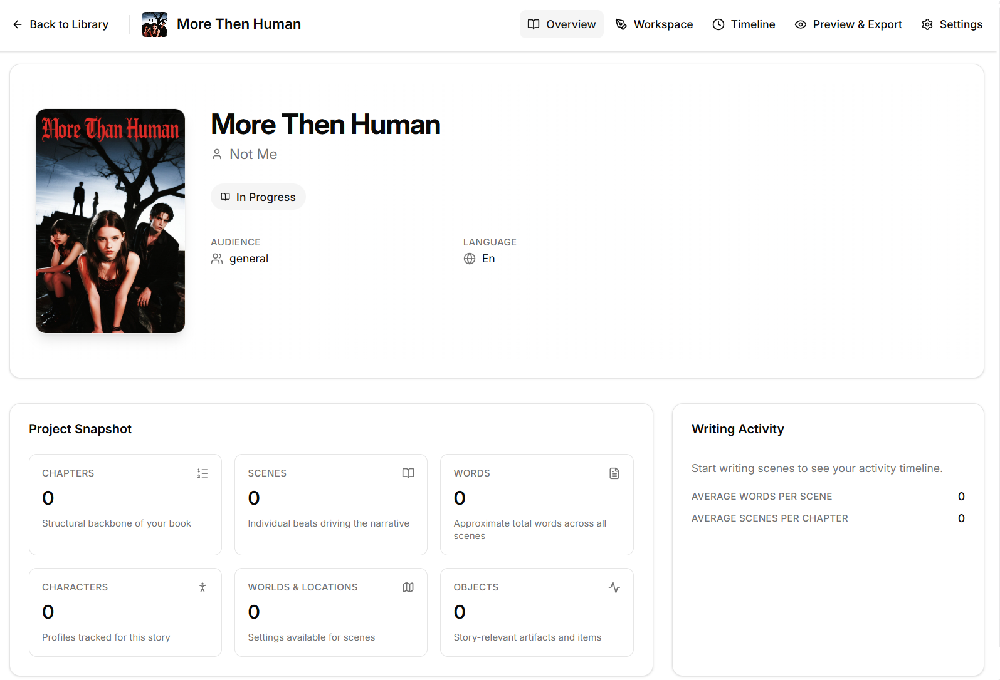
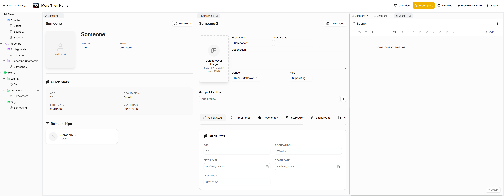

# Storyteller


**The modern, open-source writing studio for authors.**

Storyteller is a powerful desktop application designed to replace the outdated interfaces of traditional writing software. It combines the distraction-free environment of a simple text editor with the complex world-building tools needed for full-length novels and series.

Built for the modern web era, it prioritizes user experience (UI/UX), speed, and complete customizability.

## ✨ Key Features

### 📚 Project & Series Management
- **Organize Your Way:** Group your books into Series or keep them standalone.
- **Visual Dashboard:** See all your projects at a glance with status icons and progress tracking.
- **Drag & Drop Structure:** Easily rearrange Parts, Chapters, and Scenes to fix pacing or restructuring your plot.

### ✍️ Writing & Reading
- **Distraction-Free Editor:** A clean, fast rich-text editor that autosaves to your local machine.
- **Book Preview:** Switch to a **Flip-Book view** to read your draft like a real book, or view single chapters as a reader would see them.
- **Scene Metadata:** Track word counts and status (Draft, Revised, Done) for every scene.

### 🌍 World Building
- **Connected Database:** Create profiles for Characters, Locations, and Items.
- **Live Sync:** Edit a character's details in one tab, and see the changes instantly update across all open windows.
- **Interactive Timeline:** Visualize your story's chronology. Set specific start/end dates for scenes and see exactly when events happen.

### 📤 Export & Sharing
- **Universal Formats:** Export your manuscript to **PDF, EPUB, DOCX, Markdown, or TXT**.
- **Ready for Publishing:** Whether you need a raw text backup or a formatted book file, it's just one click away.

### 🧩 Flexible Interface
- **Multi-Tab Workspace:** Open anything in tabs. chapters, character sheets, or world notes and view them side-by-side.
- **Multi-Language:** Fully translated interface with native support for RTL (Right-to-Left) languages.
- **Customizable Layout:** The interface remembers your window positions and layout, so you can pick up exactly where you left off.

---

### Dashboard

*Main dashboard showing Books and Series with easy organization.*

### Book Page

*Organized pages for every aspect of your book. from characters to world building to the main writing workspace.*

### Book Workspace

*Main writing workspace with Multiple Tabs with every content you need.*

---

## 🗺️ Roadmap

For a detailed breakdown of our development phases and upcoming features, see our [ROADMAP.md](ROADMAP.md).

---

## 🚀 Getting Started

Just download the latest release from the [Releases Page](https://github.com/orielhaim/storyteller/releases) and run the installer.

#### To run the project locally for development:

1.  **Clone the repo:**
    ```bash
    git clone https://github.com/orielhaim/storyteller.git
    cd storyteller
    ```

2.  **Install dependencies:**
    ```bash
    pnpm install
    ```

3.  **Generate database migrations:**
    ```bash
    pnpm db:generate
    ```

4.  **Run the development server:**
    ```bash
    pnpm dev
    ```

---

## 📄 License

This project is licensed under the **GPLv3 License** - see the [LICENSE](LICENSE) file for details. This ensures the software remains free and open-source for everyone, forever.