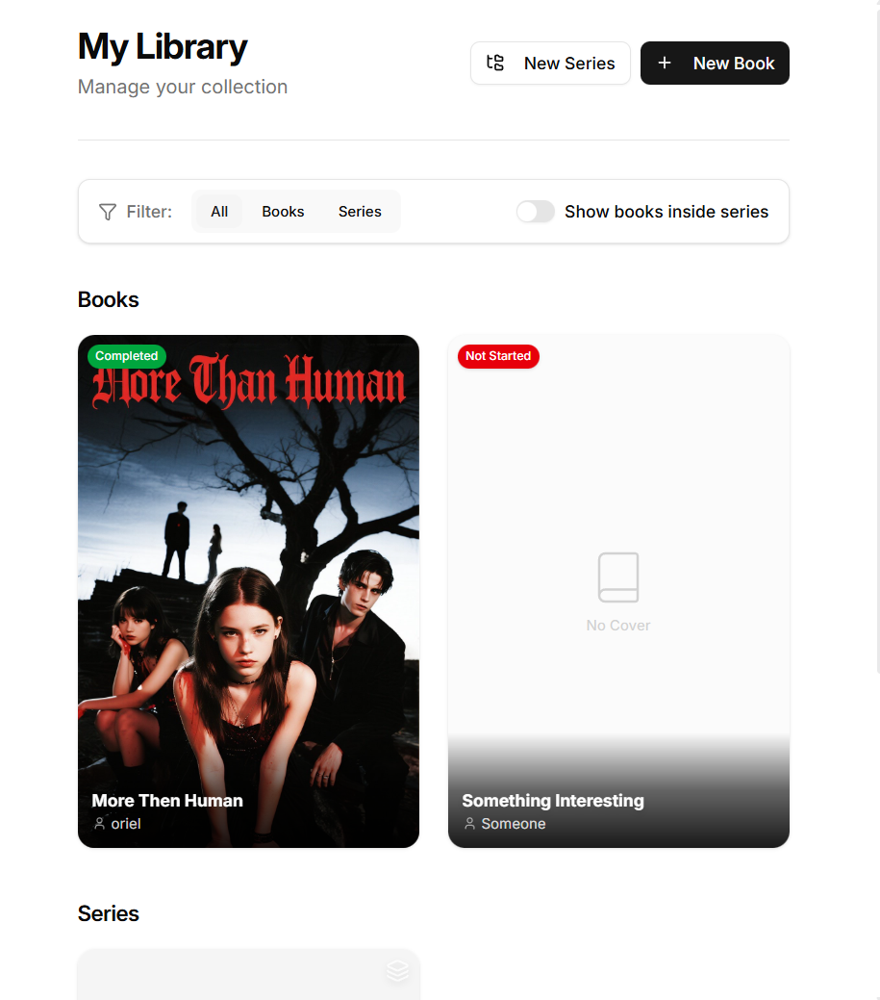

# Storyteller


**The modern, open-source writing studio for authors.**

Storyteller is a powerful desktop application designed to replace the outdated interfaces of traditional writing software. It combines the distraction-free environment of a simple text editor with the complex world-building tools needed for full-length novels and series.

Built for the modern web era, it prioritizes user experience (UI/UX), speed, and complete customizability.

## ✨ Key Features

### 📚 Project Management
- **Series & Books:** Organize your work not just by chapters, but by entire series. Keep multiple books linked within the same context.
- **Hierarchy:** Drag-and-drop structure for Parts, Chapters, and Scenes.

### ✍️ The Editor
- **Rich Text Experience:** Offering a smooth, Notion-like writing experience without the lag.
- **Distraction-Free Mode:** Focus solely on your words when you need to.

### 🧩 Flexible Interface
- **Split View & Multi-Tab:** Open multiple scenes, character sheets, or notes side-by-side.
- **Customizable Layout:** Rearrange the workspace to fit your workflow. Keep your character list pinned to the right while writing on the left.

### 🌍 World Building
- **Character Database:** Detailed profiles for your cast. Track appearance, backstory, and relationships.
- **Locations & Items:** Manage the settings and important objects of your story.
- **Timeline:** Visual timeline to track events across your story's chronology.

---

### Dashboard

*Main dashboard showing Books and Series with easy organization.*

### Book Page

*Organized pages for every aspect of your book. from characters to world building to the main writing workspace.*

### Book Workspace

*Main writing workspace with Multiple Tabs with every content you need.*

---

## 🗺️ Roadmap

For a detailed breakdown of our development phases and upcoming features, see our [ROADMAP.md](ROADMAP.md).

---

## 🚀 Getting Started

Just download the latest release from the [Releases Page](https://github.com/orielhaim/storyteller/releases) and run the installer.

#### To run the project locally for development:

1.  **Clone the repo:**
    ```bash
    git clone https://github.com/orielhaim/storyteller.git
    cd storyteller
    ```

2.  **Install dependencies:**
    ```bash
    pnpm install
    ```

3.  **Run the development server:**
    ```bash
    pnpm dev
    ```

---

## 📄 License

This project is licensed under the **GPLv3 License** - see the [LICENSE](LICENSE) file for details. This ensures the software remains free and open-source for everyone, forever.